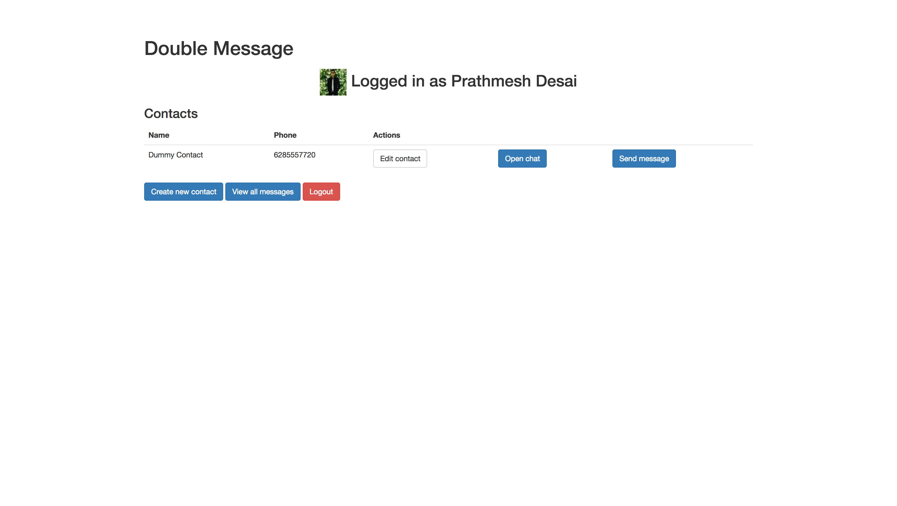
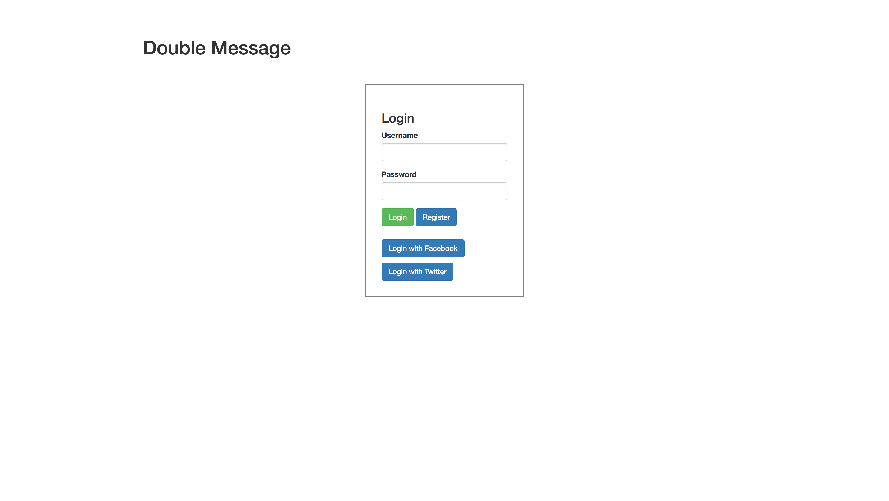
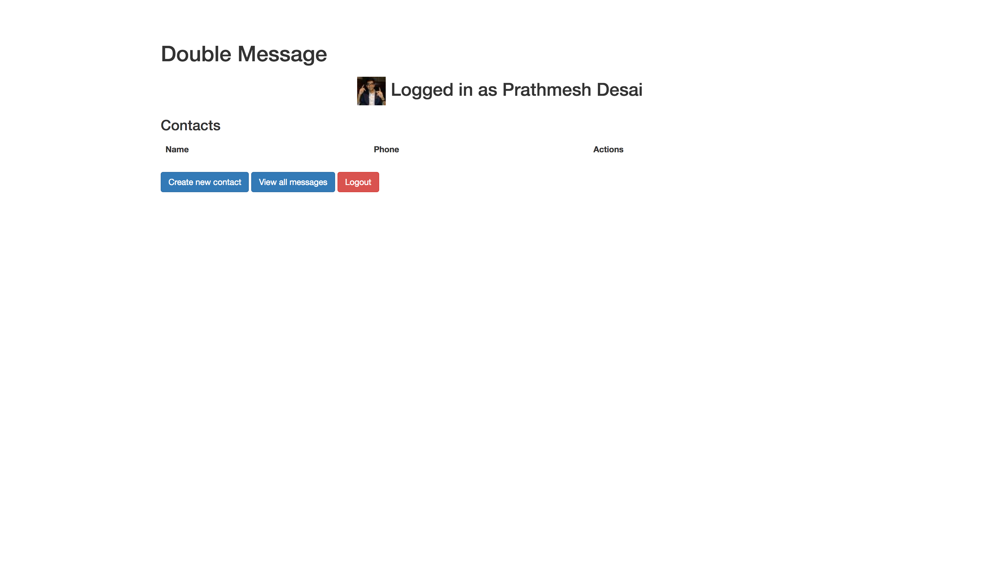
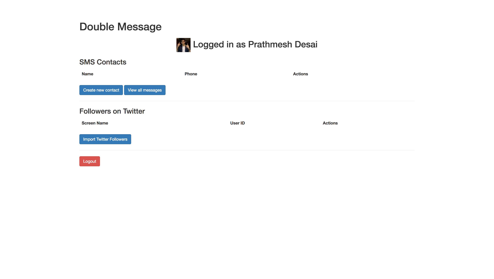
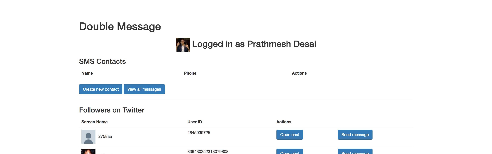
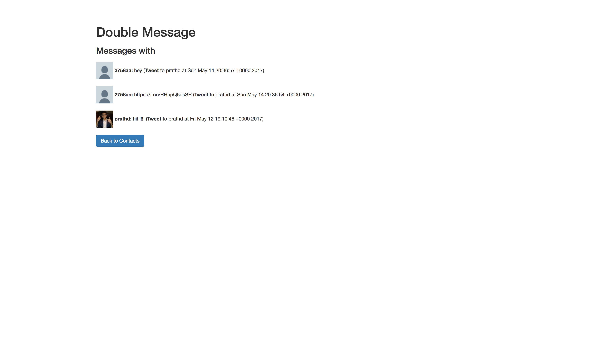
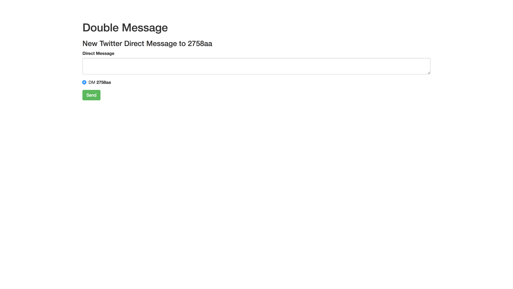
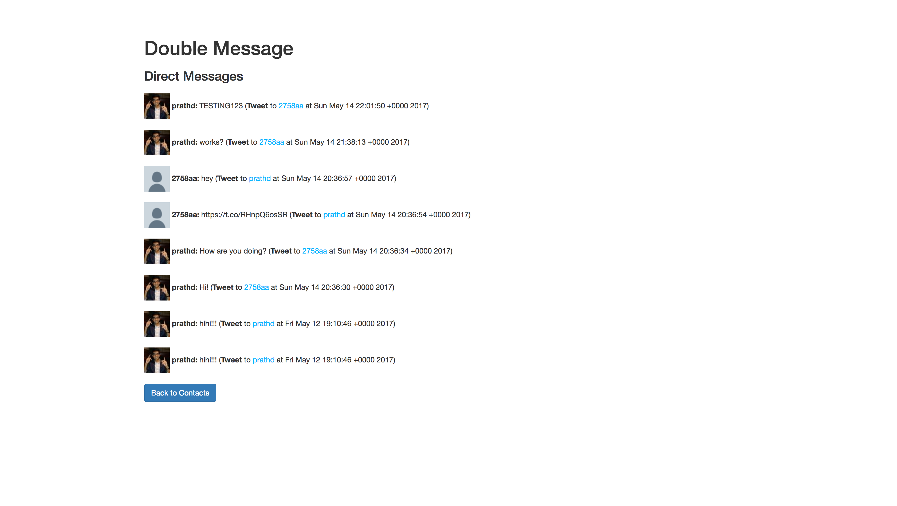

# Pair programming exercise: Double Message Part 2

**NOTE:** This is a continuation of [Part 1](readme-part1.md).

## Contents

- [Goal](#goal)
- [Step 6: Facebook login](#step-6-facebook-login)
- [Step 7. Facebook Profile Picture](#step-7-facebook-profile-picture)
- [Step 8: Create a Twitter App](#step-8-create-a-twitter-app)
- [Step 9: Twitter OAuth](#step-9-twitter-oauth)
- [Step 10: Import Twitter Following (Friends)](#step-10-import-twitter-following)
- [Step 11: Import Twitter Messages](#step-11-import-twitter-messages)
- [Step 12: Send Twitter Messages](#step-12-send-twitter-messages)
- [BONUS](#bonus)

## Goal

In Part 2, you're going to add some awesome new features and functionality to your Double Message app:

- Facebook & Twitter login (using OAuth)
- Ability to load profile picture and name from Facebook and Twitter
- Direct Message users via. Twitter

## Step 6: Facebook login

Right now it's only possible to login to your app using a username and password, but lots of modern apps allow users to login using credentials from another site such as Facebook, Google, Twitter, etc. This happens using the [OAuth 2.0](http://oauth.net/2/) protocol as discussed in class this morning. These sites, such as Facebook, act as _identity providers_. Let's add the ability for a user to login to our app using Facebook.

We're going to use the [passport-facebook](https://github.com/jaredhanson/passport-facebook) strategy for [passportjs](http://passportjs.org/) to do this. The [passport-facebook](https://github.com/jaredhanson/passport-facebook) instructions are pretty good, but we'll walk through the required steps here too.

You'll need a Facebook app ID. Head to https://developers.facebook.com/ (log into your Facebook account if necessary):


Then tap My Apps at the top right corner, and then Add a New App:


Enter a name such as "Double Message" along with an email address. You will also need to pick a category then tap Create App ID:


Respond to the captcha, then proceed by clicking "Add Product" on the left sidebar. Select "Facebook Login" choosing Website as the platform and when prompted for a Site URL enter:

    http://localhost:3000


Finally, copy the App ID and App Secret from the next screen:


Back in your `app.js` file, require the `passport-facebook` strategy:

```javascript
var FacebookStrategy = require('passport-facebook');
```

Then add code to configure the strategy immediately below where you're configuring the passport LocalStrategy:

**Note:** `User.findOrCreate` in the below code is a placeholder; this method does not currently exist on your `User` model. You need to fill this in and update your User model accordingly. __Don't forget__ to add `facebookId` to your user schema (it will be a `String`) so that your `facebookId` is stored in `MongoDB` when you log in.

`findOrCreate`: This function has the following three parameters:
1. `Object`: The property used to find an item in MongoDB
1. `Object`: Properties that aren't used in the find call, but will be added to the object if it is created
1. `Function`: Callback function

```javascript
passport.use(new FacebookStrategy({
    clientID: FACEBOOK_APP_ID,
    clientSecret: FACEBOOK_APP_SECRET,
    callbackURL: "http://localhost:3000/auth/facebook/callback"
  },
  function(accessToken, refreshToken, profile, cb) {
    User.findOrCreate({ facebookId: profile.id }, { phone: process.env.FROM_PHONE }, function (err, user) {
      return cb(err, user);
    });
  }
));
```

Fill in your Facebook App ID and App Secret which you copied from Facebook a moment ago.

Add the following routes to your `routes/auth.js` file to allow Facebook authentication:

```javascript
router.get('/auth/facebook', passport.authenticate('facebook'));

router.get('/auth/facebook/callback',
  passport.authenticate('facebook', { failureRedirect: '/login' }),
  function(req, res) {
    // Successful authentication, redirect home.
    res.redirect('/');
  }
);
```

The final step is to add a button or a link on the login page that says "Login with Facebook", linking to `/auth/facebook`. We'll let you handle that part!

Congrats, you have successfully set up Facebook OAuth! Now let's move on to getting access to the list of Facebook friends using Double Message.

## Step 7: Facebook Profile Picture

This step will walk you through displaying your profile picture & your username on the Home Page of your Application.

First add the following property to your `User` model:
- `pictureURL`: String

As a part of your FacebookStrategy you should also specify what `profileFields` should be included in the callback object, like so:
```js
{
  clientID: process.env.FB_CLIENT_ID,
  clientSecret: process.env.FB_CLIENT_SECRET,
  callbackURL: "http://[you-url-here]/auth/facebook/callback",
  profileFields: ['id', 'displayName', 'photos']
}
```

Then modify your passport `FacebookStrategy` to store the required data:
- `pictureURL` can be found at `profile.photos[0].value`
- `username` should be set to `profile.displayName`

1. Edit the `GET /contacts` request to send user information (from the `User` model) to `contacts.hbs` along with the current user's contacts.
1. Open `views/contacts.hbs` and show `username` and `picture` (as an image) at the top of your page. _Remember_ that the picture should only be shown if they logged in through Facebook.
1. Run your Node App and make sure it works. A potential example can be found below:



## Step 8: Create a Twitter App

This step will walk you through creating your Twitter App, so that we can use Twitter OAuth to log in our users.

__Disclaimer__: you will need a Twitter account to go through the following steps.

1. Navigate to [https://apps.twitter.com/](https://apps.twitter.com/)

1. Click on __Create New App__

    ![1_apps]

1. Fill out the Application details and click on __Create your Twitter application__

    _Note that your Callback URL should be localhost:3000 if you are testing the App locally, and a Heroku URL otherwise_

    ![2_create]

1. We're almost done, but now we have to make sure the App has access to direct messages. Go to the __Keys and Access Tokens__ tab, and click on __Change App Permissions__

    ![3_button]

1. Make sure __Read, Write, and Access direct messages__ is selected

    ![4_permissions]

1. Click on __Update Settings__

1. Add the following to your `env` (they can be found on the __Keys and Access Tokens__ tab)

    - `TWITTER_CONSUMER_KEY`
    - `TWITTER_CONSUMER_SECRET`

[1_apps]: ./images/1_app_overview.png
[2_create]: ./images/2_create.png
[3_button]: ./images/3_permissions_button.png
[4_permissions]: ./images/4_permissions.png

## Step 9: Twitter OAuth

The goal of this step is to implement Twitter OAuth in your Application. You will be using the [passport-twitter](https://github.com/jaredhanson/passport-twitter) package. Notice that it is implemented similarly to `passport-facebook`, so the instructions regarding Facebook OAuth and the docs for `passport-twitter` should be all you need to complete this section.

### Goal





## Step 10: Import Twitter Following

1. Install the [`twitter`](https://www.npmjs.com/package/twitter) `npm` package. We will use this package to make requests against Twitter's API.

    ```bash
    npm i -S twitter
    ```

1. Add a `followers` key to your `User` model (it will be of type `Object` as it's an array)

1. Make sure you have access to the `twitterToken` and `twitterTokenSecret` in `req.user` (as you will need these values when using the `twitter` npm module in the next step)

1. In your `routes/index.js` add the `/twitter/import` route. Make sure you...
    - Using the [`twitter` npm module](https://www.npmjs.com/package/twitter), make a `GET` request to `followers/list.json?count=200` (we will only be displaying the first 200 followers for the purposes of this Application)
    - Via the `findOneAndUpdate` method, look up the current user in the `User` model and set the `followers` key to the array of users returned by Twitter's API
    - Make sure to redirect back to `/contacts` once the follower data has been saved to the model

1. __IF__ the user is logged in using Twitter, add the following to `contacts.hbs` (_example below_):
    - __Show All Messages__ button: This will show you all direct messages sent & received for your Twitter user
    - __Followers on Twitter__ section: should contain Screen Name, User ID, and Send Message Button (empty initially)
    - __Import Twitter Followers__ button that links to the `/twitter/import` route

### Testing

Now let's see if it works! Log in via. Twitter and import your contacts. Below are screenshots displaying what your page should look like with this additional functionality. Next let's figure out how to Direct Message these Twitter users.





## Step 11: Import Twitter Messages

1. Link the __Show All Messages__ button to `/twitter/messages` in `contacts.hbs`
1. Create a `GET /twitter/messages` endpoint: This endpoint will use the `twitter` npm module to perform `GET` requests to `/direct_messages` _(all received messages)_ and `/direct_messages/sent` _(all sent messages)_
    - use `console.log()` to look at what the responses looks like
    - you need to __combine__ the responses from the two endpoints and sort them by time
    - render `twitterMessages.hbs` and pass in the combined array of messages
1. Create a view called `twitterMessages.hbs`
    - __NOTE__ that you can either create this view or modify the existing `messages.hbs` file to work with Twitter DMs

### Goal



## Step 12: Send Twitter Messages

This is the final step, we're almost done! We will be using the [`POST /direct_messages/new`](https://dev.twitter.com/rest/reference/post/direct_messages/new) endpoint to send DMs to users. Let's see if you can do this step by yourself! We have given you an outline of what you will need to do for this step below:

- Create a `GET /twitter/messages/send/:id` route: Looks for the specified follower given the `id` in params, and renders `newMessage.hbs` for that follower (you will need the screen name)
- Create a `POST /twitter/messages/send/:id` route: Performs `POST /direct_messages/new` to send the message to the appropriate user (your `POST` must include `screen_name` and `text`)

### Goal

Send Message:


Redirect to `/twitter/messages` once message sent:


## Bonus

- [Send messages in bulk to many users at a
  time](https://docs.google.com/presentation/d/1vq9b1ENst72z1v0JgxGkhjZA6bggbgCNWO-CNf3zrIc/edit#slide=id.g11476959af_5_167)
  (if you didn't get to this yesterday).
- Create true multi-party "threading" functionality: if a user composes a
  message to contacts A, B, and C, then if _any_ of those contacts responds to
  the message, it goes to _everyone_ on the thread.

Add the following to OAuth:

- If a user who is already registered using Facebook/Twitter subsequently tries to
  register using a username and password.
- If a user registers with a username and password, then subsequently tries to
  register, or log in, using Facebook/Twitter.
- If a user who is already registered with a username and password wants to link
  their Facebook/Twitter account so that they can log in using Facebook/Twitter in the future.
- If a user wants to unlink their Facebook/Twitter account.
